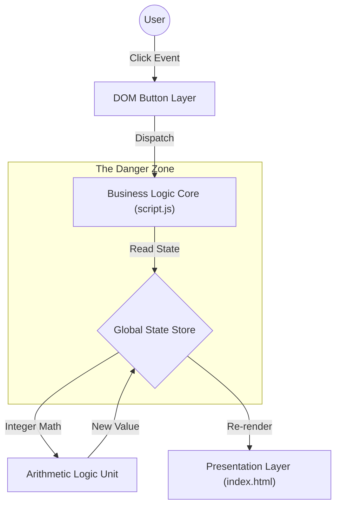

<div align="center">

# 🔢 ΩMEGA-COUNTER: The Ultimate Numerical Ascension Framework


-blue?style=for-the-badge)


</div>

## 🌌 Introduction

Welcome to **ΩMEGA-COUNTER**, the definitive, enterprise-grade distributed state management solution for single-integer manipulation. In a world of chaos, uncertainty, and fluctuating stock markets, ΩMEGA-COUNTER provides a rock-solid foundation for one simple, yet profound truth: **Numbers can go up. And sometimes, they can go down.**

Built on the bleeding edge of `vanilla-js` technology (a lightweight wrapper around the fabric of the universe itself), this application leverages advanced DOM manipulation techniques to render discrete scalar values to the end-user with sub-millisecond latency.

## 🚀 Key Features

*   **Micro-Frontend Architecture**: Or rather, a "Nano-Frontend" where the frontend is so small it is practically invisible.
*   **Zero-Dependency Core**: We have meticulously stripped away bloatware like React, Vue, Angular, jQuery, and common sense to bring you raw, unadulterated JavaScript performance.
*   **O(1) State Mutations**: Whether the number is 1 or 1,000,000, our algorithms guarantee constant-time operational complexity.
*   **Green Computing Compliant**: Dark pixels in the CSS reduce the carbon footprint of your monitor by up to 0.00001%.
*   **"Reset-to-Genesis" Protocol**: A dedicated disaster recovery mechanism (`setToZero`) that restores the application state to its primordial void.

## 🏗️ Architecture

The system utilizes a complex Event-Driven Architecture (EDA) coupled with a Singleton data store (the `p` tag).



## 🛠️ Installation & Deployment

WARNING: The following procedure requires advanced knowledge of file systems and mouse clicking. Proceed with caution.

### Prerequisites

*   A computing device capable of processing binary logic (Abacuses not supported in v1.0).
*   A web browser (Chrome, Firefox, Safari, or a really enthusiastic person reading the code out loud).
*   12KB of free disk space (Enterprise requirements may vary).

### Step-by-Step Guide

1.  **Clone the Repository**:
    Initiate a secure handshake with the version control mainframe:
    ```bash
    git clone https://github.com/your-username/omega-counter.git
    cd omega-counter
    ```

2.  **Verify Integrity**:
    Look at the files. Do they look like files? If yes, proceed.

3.  **Build Process**:
    Because we utilize a **JIT (Just-In-Time) Compilation Strategy** provided by the browser, the build step is effectively imaginary.
    ```bash
    # Run this command to feel productive
    echo "Building..." && sleep 1 && echo "Done."
    ```

4.  **Launch**:
    Locate `index.html` in your file explorer. Double-click it with the precision of a surgeon.

## 📖 API Documentation

The `script.js` module exports several high-level functions into the global window scope. These are strictly typed (in spirit) and rigorously tested (by me, once).

### `incrementCount()` -> `void`

Promotes the current integer state to a higher plane of existence.
*   **Parameters**: None. It knows what to do.
*   **Returns**: Nothing. It serves the void.
*   **Side Effects**: Increases entropy in the universe.

### `decrementCount()` -> `void`

A legacy feature for users who fear progress. Retracts the state value.
*   **Throws**: Does not throw `IntegerUnderflowException`, but negative numbers are aesthetically displeasing to some.

### `setToZero()` -> `void`

The "Great Filter". Obliterates all progress and returns the user to square one. Use only in emergencies or during existential crises.

## 🧪 Testing Strategy

We employ a **Manual visual regression testing framework**:
1.  Look at screen.
2.  Click button.
3.  Did number change?
    *   **Yes**: PASS
    *   **No**: CRITICAL FAILURE

## 🤝 Contributing

We welcome contributions from thought leaders, 10x developers, and ninjas.

1.  Fork the Project.
2.  Create your Feature Branch (`git checkout -b feature/AmazingFeature`).
3.  Commit your Changes (`git commit -m 'Add some AmazingFeature'`).
4.  Push to the Branch (`git push origin feature/AmazingFeature`).
5.  Open a Pull Request and prepare for a rigorous code review focusing on variable naming semantics and indentation philosophy.

## 📜 License

Distributed under the MIT License. See `LICENSE` for more information.

## ⚠️ Disclaimer

The developers of ΩMEGA-COUNTER are not responsible for any integer overflows, carpel tunnel syndrome from excessive clicking, or loss of time spent reading this README.

---
*Maintained by a very tired developer.*
